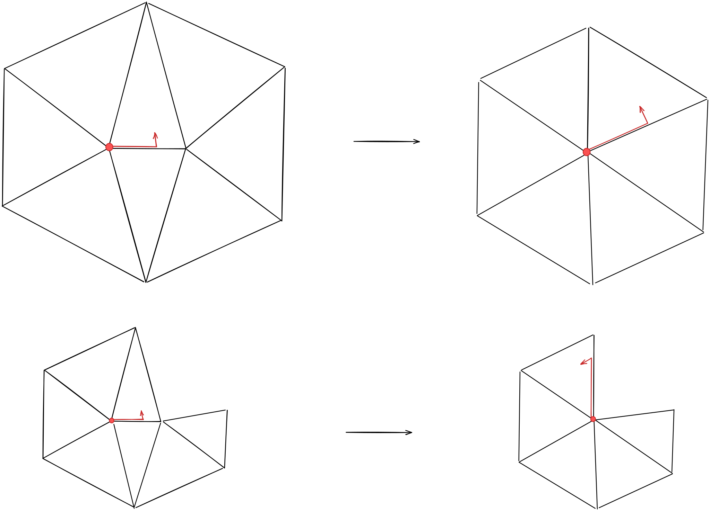
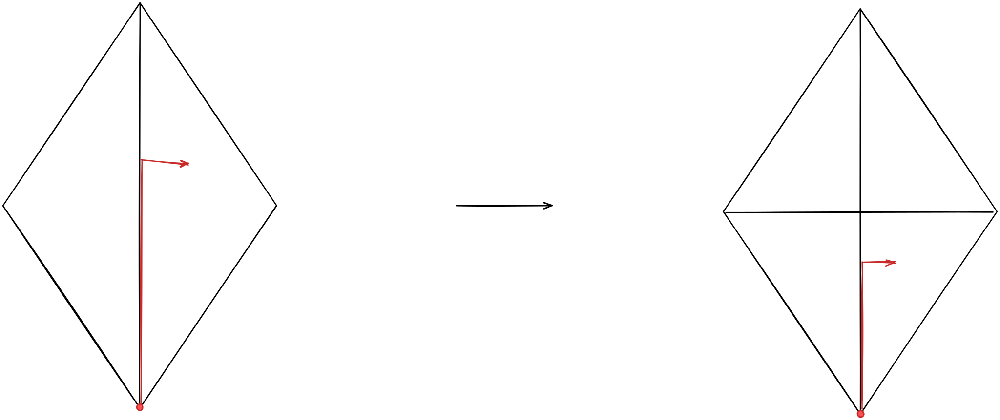
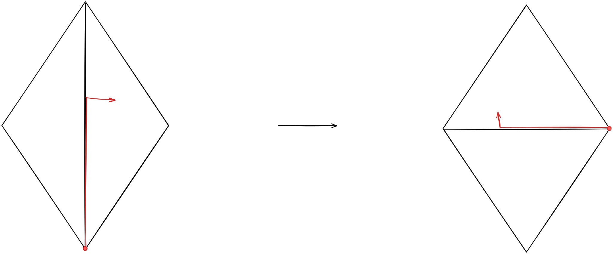
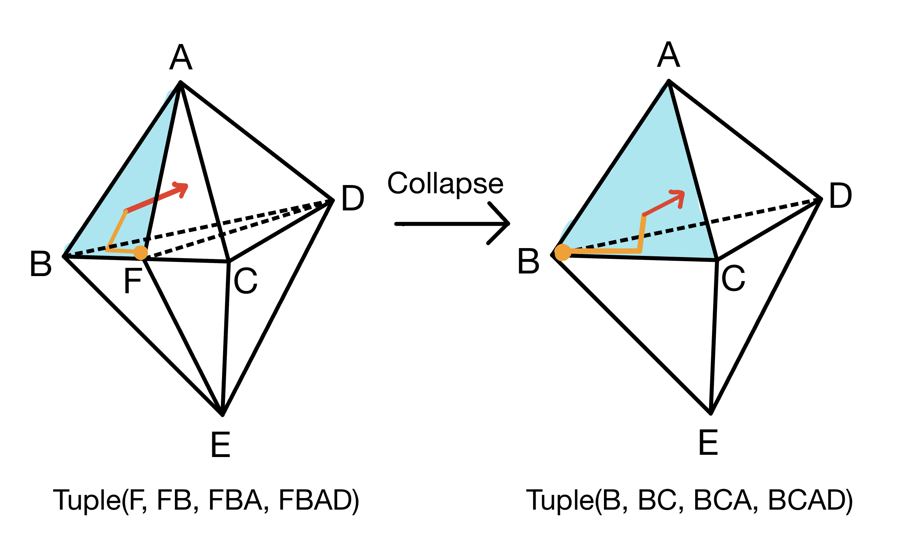
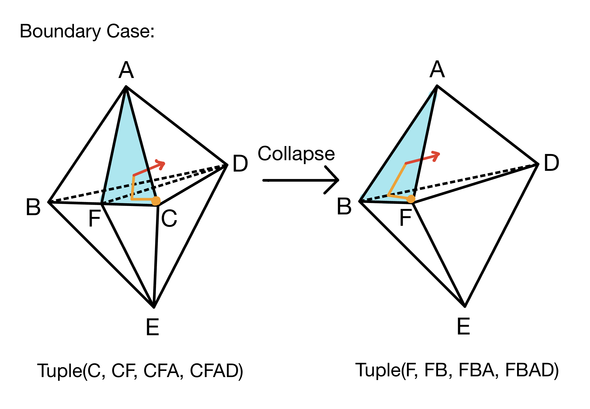
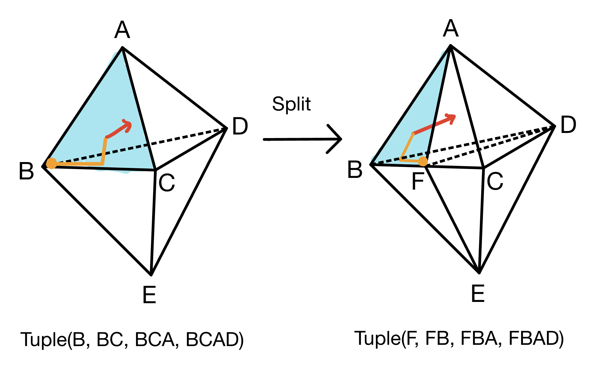
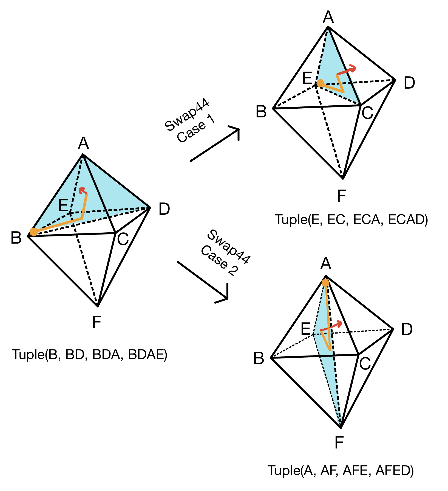
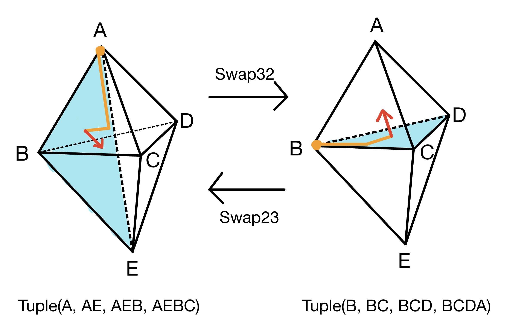

[](https://github.com/wildmeshing/wildmeshing-toolkit/actions/workflows/continuous.yml)
[](https://codecov.io/github/wildmeshing/wildmeshing-toolkit)

# Wildmeshing-toolkit: Declarative Specification for Unstructured Mesh Editing Algorithms


This repository has gone through substantial changes that diverge from the API described by the SIGGRAPH Asia 2022 paper.
This prior version can be accessed [here]([wildmeshing-toolkit/tree/1.0](https://github.com/wildmeshing/wildmeshing-toolkit/releases/tag/1.0)) as tag 1.0.

## Installation

#### via CMake

- Clone the repository into your local machine:

```bash
git clone https://github.com/wildmeshing/wildmeshing-toolkit.git
```

- Compile the code using cmake>3.20.0

```bash
cd wildmeshing-toolkit
mkdir build
cd build
cmake -DCMAKE_BUILD_TYPE=Release ..
make
```

You may need to install `gmp` before compiling the code. You can install `gmp` via [homebrew](https://brew.sh/).

Perl ([Windows link](https://strawberryperl.com/)) needs to be installed before running `cmake`. This is a requirement from `hdf5`.

## Usage
To reproduce figures from the paper, please use the commands from [reproduce_scripts](reproduce_scripts.sh). Note that the input data are from `wmtk-data-package.zip`. (Download: https://drive.google.com/drive/folders/1jFdQ77E2_n3EJF5_bPOOMEOxF4dyctjN?usp=sharing)


## About Us
This toolkit is a novel approach to describe mesh generation, mesh adaptation, and geometric modeling algorithms relying on changing mesh connectivity using a high-level abstraction. The main motivation is to enable easy customization and development of these algorithms via a declarative specification consisting of a set of per-element invariants, operation scheduling,and attribute transfer for each editing operation.

Many widely used algorithms editing surfaces and volumes
can be compactly expressed with our abstraction, and their implementation
within our framework is simple, automatically parallelizable on shared-
memory architectures, and with guaranteed satisfaction of the prescribed
invariants. These algorithms are readable and easy to customize for specific use cases.

This software library implements the abstractiona in our paper and providing automatic shared memory parallelization.

We will use the implementation of the shortest edge collapse algorithm as an example to introduce the framework and run through the basic software structures and APIs of the toolkit. All the code that is referenced below can be found under the `app` folder of the toolkit.

## Basic Algorithm
The algorithm is after [Hoppe 1996] Progressive Meshes which performs a series of collapse operations prioritizing the shorter edges. The algorithm requires only one local operation, edge collapse. We terminate when the mesh reaches a desired number of mesh elements. For every collapsed edge, we generate a new vertex at the midpoint of the edge.

We implemented `class ShortestEdgeCollapse` as a child class of `wmtk::TriMesh`. The 3d vertex positions are stored as a field of the `VertexAttributes`.
```
struct VertexAttributes
{
 >> Eigen::Vector3d pos;
    size_t partition_id = 0;
    bool freeze = false;
};
```

## Explicit Invariant Design
It is common to have a set of desiderata on
the mesh that needs to be satisfied, such as avoiding triangle insertions or self-intersections. The responsibility of ensuring the user-defined explicit invariants being checked after every mesh
modification, and after the input is loaded is assumed by the toolkit. It is much easier to ensure correctness for the user, as
the checks are handled transparently by the toolkit.

As an example of user-defined invariants, in our shortest edge collapse implementation, we created an envelope around the original surface and designated that any operation shall not cause any vertex to move outside of the envelop, so that during local operations we can roughly keep the shape of the input mesh and avoid self-intersection.

```
bool sec::ShortestEdgeCollapse::invariants(const std::vector<Tuple>& new_tris)
{
    if (m_has_envelope) {
        for (auto& t : new_tris) {
            std::array<Eigen::Vector3d, 3> tris;
            auto vs = oriented_tri_vertices(t);
            for (auto j = 0; j < 3; j++) tris[j] = vertex_attrs[vs[j].vid(*this)].pos;
            bool outside = m_envelope.is_outside(tris);
            if (outside) return false;
        }
    }
    return true;
}
```
The envelope development is after [Exact and Efficient Polyhedral Envelope Containment Check](https://cims.nyu.edu/gcl/papers/2020-Fast-Envelope.pdf)


## Explicit Attribute Update
Opposed to the common practice of attaching mesh attributes to mesh elements we enable the users to only provide the rules on how to update attributes after local operations in a high-level specifications. The actual update is handled entirely by the toolkit.

This easy-to-write user-specified update rule is examplified in our shortest edge collapse as below
```
bool sec::ShortestEdgeCollapse::collapse_edge_after(const TriMesh::Tuple& t)
{
    const Eigen::Vector3d p = (position_cache.local().v1p + position_cache.local().v2p) / 2.0;
    auto vid = t.vid(*this);
    vertex_attrs[vid].pos = p;

    return true;
}
```

## Operation Rollback
It is common to perform mesh editing to
improve a given energy functional, such as mesh quality or element
size. However, due to the discrete nature of the operations, it is
not possible to use standard smooth optimization techniques, and
instead the effect of the energy is evaluated before and after every
operation to measure its effect on the energy. If the user desires a certain property of the mesh for each operation, the desiderata can be easily coded up as a check in the after operation.

If either the user specified invariants or the after operation check/update has failed, the toolkit will perform an operation rollback that restores the mesh configuration to before the operation. And our toolkit also handles the recovery of element attributes on this occasion. The rollback and attribute protection gurantee both topology and geometry consistency for the mesh. Users would not need to perform any manual updates were the operations to fail, thank to the rollback.

## Operation Demonstration

For easier usage and customization, here we demonstrate the before and after of each operation and the vertex, edge, face, and tet (in 3d) that is reference.

### 2D operations
- **edge collapse**


- **edge split**

- **edge swap**


- **vertex smooth**
This operation do not change the reference.

### 3D operations
- **edge collapse**


- **edge collapse boundary case**


- **edge split**


- **edge swap 4-4**


- **edge swap 2-3 & 3-2**



## Parallel Scheduling
The type and scheduling of local operations is crucial in mesh editing algorithms. This involves maintaining a priority queue of operations, which is updated after every local operation.

We provide a direct way of controlling the operations performed
and how the queue is updated through our scheduler. The main purpose of the scheduler is to
abstract the operation order and hide parallelization details from
the user. Our scheduler provides customizable callbacks, including, *Priority*, *Renew neighbor*, *Lock vertices*, *Stopping criterion*.

For shortest edge collapse, we want to attempt to collapse all edges, prioritizing the shortest ones, until we reach a fixed number of vertices.

```
for (auto& loc : get_edges()) collect_all_ops.emplace_back("edge_collapse", loc);
```

  We put here the example of our shortest edge collapse implementation of the *Priority* and *Renew neighbor*, and how they are used in scheduler.
```
  auto renew = [](auto& m, auto op, auto& tris) {
      auto edges = m.new_edges_after(tris);
      auto optup = std::vector<std::pair<std::string, Tuple>>();
      for (auto& e : edges) optup.emplace_back("edge_collapse", e);
      return optup;
  };
  auto measure_len2 = [](auto& m, auto op, const Tuple& new_e) {
      auto len2 =
          (m.vertex_attrs[new_e.vid(m)].pos - m.vertex_attrs[new_e.switch_vertex(m).vid(m)].pos)
              .squaredNorm();
      return -len2;
  };
  auto setup_and_execute = [&](auto executor) {
      executor.num_threads = NUM_THREADS;
  >> executor.renew_neighbor_tuples = renew;
  >> executor.priority = measure_len2;
      executor.stopping_criterion_checking_frequency =
          target_vert_number > 0 ? (initial_size - target_vert_number - 1)
                                  : std::numeric_limits<int>::max();
      executor.stopping_criterion = [](auto& m) { return true; };
      executor(*this, collect_all_ops);
  };
```

## Command Line Executions for Example Applications
To showcase the generality and effectiveness of our approach, we
implemented five popular mesh editing algorithms in our framework. We provide the command lines and corresponding parameters for running the these applications as below:

```
cd build
```

- ### Shortest Edge Collpase : [Progressive Meshes](https://hhoppe.com/pm.pdf)
```
Usage:./app/sec_app input output [OPTIONS]

Required:
  input                       Input surface mesh INPUT in .off/.obj/.stl/.ply format.
  output                      Output tetmesh OUTPUT in .obj format.

Options:
  -e,--envelope               Relative envelope size. enveleope_size = diag_of_bbox * e. negative to disable.
  -j, --thread thread         Thread number.
  -t, --target                Percentage of input vertices in output.
```
- ### Qslim : [Surface Simplification Using Quadric Error Metrics](https://dl.acm.org/doi/pdf/10.1145/258734.258849)
```
Usage:./app/qslim_app input output [OPTIONS]

Required:
  input                       Input surface mesh INPUT in .off/.obj/.stl/.ply format.
  output                      Output tetmesh OUTPUT in .obj format.

Options:
  -e,--envelope               Relative envelope size. enveleope_size = diag_of_bbox * e. negative to disable.
  -j, --thread thread         Thread number.
  -t, --target                Percentage of input vertices in output.
```
- ### Isotropic Remeshing : [A Remeshing Approach to Multiresolution Modeling](https://ls7-gv.cs.tu-dortmund.de/downloads/publications/2004/sgp04.pdf)
```
Usage:./app/remeshing_app input output [OPTIONS]

Required:
  input                       Input surface mesh INPUT in .off/.obj/.stl/.ply format.
  output                      Output tetmesh OUTPUT in .obj format.

Options:
  -e,--envelope               Relative envelope size. enveleope_size = diag_of_bbox * e negative to disable.
  -j, --thread thread         Thread number.
  -r, --relativelength        Relative edge length. Target edge length in output mesh is min(diag * rel_len, 5 * avg_len).
  -a, --absolutelengt         Absolute edge length in output mesh.
  -i, --iterations            Number of remeshing itrs.
  -f, --freeze                To freeze the boundary, default to true.
  --sample-envelope           use sample envelope, default to false.
```
- ### Harmonic Triangulations : [Harmonic Triangulations](https://dl.acm.org/doi/pdf/10.1145/3306346.3322986)
```
Usage:
./app/harmonic_tet/wmtk_harmonic_tet_bin input output

Required:
  input                       Input surface mesh INPUT in .off/.obj/.stl/.ply format.
  output                      Output tetmesh OUTPUT in .msh format.

Options:
  -j, --thread thread         Thread number.
  --harmonize                 Enable to use for point cloud.
```

- ### Tetwild : [Tetrahedral Meshing in the Wild](https://cims.nyu.edu/gcl/papers/2018-TetWild.pdf)
```
Usage:
./app/tetwild/tetwild -i input -o output

Required:
  input                       Input surface mesh INPUT in .off/.obj/.stl/.ply format.
  output                      Output tetmesh OUTPUT in .msh format.

Options:
  -e,--epsr                   Relative envelope size. enveleope_size = diag_of_bbox * e negative to disable.
  -j, --thread thread         Thread number.
  --skip-simplify             Skip simplify_input.
  --max-its                   Max # its.
  -r, --rlen                  Relative ideal edge length wrt diag of bbox.
  --filter-with-input         Filter with input mesh, default is tracked surface.
  --sample-envelope           Use sample envelope for both simp and optim.
```

## License

MIT License.

## [Contribution Guide](contribution_guide.md)
