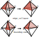
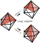

# Wildmeshing-toolkit: Declarative Specification for Unstructured Mesh Editing Algorithms

## Installation

#### via CMake

- Clone the repository into your local machine:

```bash
git clone https://github.com/wildmeshing/wildmeshing-toolkit.git
```

- Compile the code using cmake>3.20.0

```bash
cd wildmeshing-toolkit
mkdir build
cd build
cmake -DCMAKE_BUILD_TYPE=Release ..
make
```

You may need to install `gmp` before compiling the code. You can install `gmp` via [homebrew](https://brew.sh/).

## Usage

When executing CMake, the [data repository](https://github.com/wildmeshing/data2) will be automatically cloned into the `data` folder. You can find example meshes and json files for testing there. After compiling the code, you can run the applications under the `app` folder, e.g. for isotropic remeshing:

```bash
./build/app/wmtk_app -j data/integration_tests/isotropic_remeshing_bunny.json
```

## About Us

This toolkit is a novel approach to describe mesh generation, mesh adaptation, and geometric modeling algorithms relying on changing mesh connectivity using a high-level abstraction. The main motivation is to enable easy customization and development of these algorithms via a declarative specification consisting of a set of per-element invariants, operation scheduling,and attribute transfer for each editing operation.

Many widely used algorithms editing surfaces and volumes can be compactly expressed with our abstraction, and their implementation within our framework is simple, automatically parallelizable on shared-memory architectures, and with guaranteed satisfaction of the prescribed invariants. These algorithms are readable and easy to customize for specific use cases.

This software library implements the abstractiona in our paper and providing automatic shared memory parallelization.

We will use the implementation of the shortest edge collapse algorithm as an example to introduce the framework and run through the basic software structures and APIs of the toolkit.

## Example: Shortest Edge Collapse

### Basic Algorithm

The algorithm is after [Hoppe 1996] Progressive Meshes which performs a series of collapse operations prioritizing the shorter edges. The algorithm requires only one local operation, edge collapse. We terminate when the mesh reaches a desired number of mesh elements.

We implemented `class ShortestEdgeCollapse` as a child class of `wmtk::TriMesh`. The 3d vertex positions are stored as a field of the `VertexAttributes`.

```C++
struct VertexAttributes
{
    Eigen::Vector3d pos;
    size_t partition_id = 0;
    bool freeze = false;
};
```

### Explicit Invariant Design

It is common to have a set of desiderata on the mesh that needs to be satisfied, such as avoiding triangle insertions or self-intersections. The responsibility of ensuring the user-defined explicit invariants being checked after every mesh
modification, and after the input is loaded is assumed by the toolkit. It is much easier to ensure correctness for the user, as the checks are handled transparently by the toolkit.

As an example of user-defined invariants, in our shortest edge collapse implementation, we created an envelope around the original surface and designated that any operation shall not cause any vertex to move outside of the envelop, so that during local operations we can roughly keep the shape of the input mesh.

```C++
bool ShortestEdgeCollapse::invariants(const std::vector<Tuple>& new_tris)
{
    if (m_has_envelope) {
        for (auto& t : new_tris) {
            std::array<Eigen::Vector3d, 3> tris;
            auto vs = oriented_tri_vertices(t);
            for (auto j = 0; j < 3; j++) tris[j] = vertex_attrs[vs[j].vid(*this)].pos;
            bool outside = m_envelope.is_outside(tris);
            if (outside) return false;
        }
    }
    return true;
}
```

The envelope development is after [Exact and Efficient Polyhedral Envelope Containment Check](https://cims.nyu.edu/gcl/papers/2020-Fast-Envelope.pdf)

### Explicit Attribute Update

Opposed to the common practice of attaching mesh attributes to mesh elements we enable the users to only provide the rules on how to update attributes after local operations in a high-level specifications. The actual update is handled entirely by the toolkit.

This easy-to-write user-specified update rule is examplified in our shortest edge collapse as below

```C++
bool ShortestEdgeCollapse::collapse_edge_after(const TriMesh::Tuple& t)
{
    const Eigen::Vector3d p = (position_cache.local().v1p + position_cache.local().v2p) / 2.0;
    auto vid = t.vid(*this);
    vertex_attrs[vid].pos = p;
    return true;
}
```

### Operation Rollback

It is common to perform mesh editing to improve a given energy functional, such as mesh quality or element size. However, due to the discrete nature of the operations, it is not possible to use standard smooth optimization techniques, and instead the effect of the energy is evaluated before and after every operation to measure its effect on the energy. If the user desires a certain property of the mesh for each operation, the desiderata can be easily coded up as a check in the after operation.

If either the user specified invariants or the after operation check/update has failed, the toolkit will perform an operation rollback that restores the mesh configuration to before the operation. And our toolkit also handles the recovery of element attributes on this occasion. The rollback and attribute protection gurantee both topology and geometry consistency for the mesh. Users would not need to perform any manual updates were the operations to fail, thanks to the rollback.

### Operation Demonstration

For easier usage and customization, here we demonstrate the before and after state of each operation and the vertex, edge, face, and tet (in 3d) that is reference.

#### 2D operations

- **edge split**

  

- **edge collapse**

  

- **edge swap**

  

- **vertex smooth**

  This operation does not change the mesh connectivity.

#### 3D operations

- **edge split**

  

- **edge collapse**

  

- **edge swap / face swap**

  

- **edge swap 4-4**

  

- **edge swap 5-6**

  Similar to 4-4 edge swap.

- **vertex smooth**

  This operation does not change the mesh connectivity.

## Parallel Scheduling

The type and scheduling of local operations is crucial in mesh editing algorithms. This involves maintaining a priority queue of operations, which is updated after every local operation.

We provide a direct way of controlling the operations performed and how the queue is updated through our scheduler. The main purpose of the scheduler is to abstract the operation order and hide parallelization details from the user. Our scheduler provides customizable callbacks, including, _Priority_, _Renew neighbor_, _Lock vertices_, _Stopping criterion_.

For shortest edge collapse, we want to attempt to collapse all edges, prioritizing the shortest ones, until we reach a fixed number of vertices.

```C++
for (auto& loc : get_edges()) collect_all_ops.emplace_back("edge_collapse", loc);
```

We put here the example of our shortest edge collapse implementation of the _Priority_ and _Renew neighbor_, and how they are used in scheduler.

```C++
  auto renew = [](auto& m, auto op, auto& tris) {
      auto edges = m.new_edges_after(tris);
      auto optup = std::vector<std::pair<std::string, Tuple>>();
      for (auto& e : edges) optup.emplace_back("edge_collapse", e);
      return optup;
  };
  auto measure_len2 = [](auto& m, auto op, const Tuple& new_e) {
      auto len2 =
          (m.vertex_attrs[new_e.vid(m)].pos - m.vertex_attrs[new_e.switch_vertex(m).vid(m)].pos)
              .squaredNorm();
      return -len2;
  };
  auto setup_and_execute = [&](auto executor) {
      executor.num_threads = NUM_THREADS;
  >> executor.renew_neighbor_tuples = renew;
  >> executor.priority = measure_len2;
      executor.stopping_criterion_checking_frequency =
          target_vert_number > 0 ? (initial_size - target_vert_number - 1)
                                  : std::numeric_limits<int>::max();
      executor.stopping_criterion = [](auto& m) { return true; };
      executor(*this, collect_all_ops);
  };
```

## Command Line Executions for Example Applications

To showcase the generality and effectiveness of our approach, we implemented five popular mesh editing algorithms in our framework. All algorithms are accessed through the same application `wmtk_app` and the user can specify which algorithm to run through the input JSON file. The five algorithms are listed below.

The JSON files are processed with the [JSON Spec Engine](https://github.com/geometryprocessing/json-spec-engine).

- Shortest Edge Collpase :
  - Paper: [Progressive Meshes](https://hhoppe.com/pm.pdf)
  - [shortest_edge_collapse_spec.json](https://github.com/wildmeshing/wildmeshing-toolkit/components/shortest_edge_collapse/wmtk/components/shortest_edge_collapse/shortest_edge_collapse_spec.json)

- Qslim :
  - Paper: [Surface Simplification Using Quadric Error Metrics](https://dl.acm.org/doi/pdf/10.1145/258734.258849)
  - [qslim_spec.json](https://github.com/wildmeshing/wildmeshing-toolkit/components/qslim/wmtk/components/qslim/qslim_spec.json)

- Isotropic Remeshing :
  - Paper: [A Remeshing Approach to Multiresolution Modeling](https://ls7-gv.cs.tu-dortmund.de/downloads/publications/2004/sgp04.pdf)
  - [isotropic_remeshing_spec.json](https://github.com/wildmeshing/wildmeshing-toolkit/components/isotropic_remeshing/wmtk/components/isotropic_remeshing/isotropic_remeshing_spec.json)

- TetWild :
  - Paper: [Tetrahedral Meshing in the Wild](https://cims.nyu.edu/gcl/papers/2018-TetWild.pdf)
  - [tetwild_spec.json](https://github.com/wildmeshing/wildmeshing-toolkit/components/tetwild/wmtk/components/tetwild/tetwild_spec.json)

- TriWild :
  - Paper: [Triangular Meshing in the Wild](https://cims.nyu.edu/gcl/papers/2019-TriWild.pdf)
  - [triwild_spec.json](https://github.com/wildmeshing/wildmeshing-toolkit/components/triwild/wmtk/components/triwild/triwild_spec.json)

Examples for all algorithms can be found in the [data repository](https://github.com/wildmeshing/data2).

## License

MIT License.
