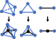

# Simplicial Embedding

A substructure is simplicially embedded, if every simplex of the embedding contains only a single substructure simplex and its faces.

To create a simplicial embedding, we use the following split operations:

This application expects a .msh file with tags on tetrahedra that represent substructures. The tags must be integer numbers.

Currently, the application has two different modes.

1. Specify a `tag_value`: The mesh is modified such that it becomes a simplicial embedding of the given tag.
2. Set `embed_interfaces` to true: The interfaces between all substructures (including the boundary) are considered as substructure. The mesh is modified such that it becomes a simplicial embedding of that substructure. The `tag_value` is ignored in that mode.

The output is a .msh file with the modified mesh and the tag attribute.
